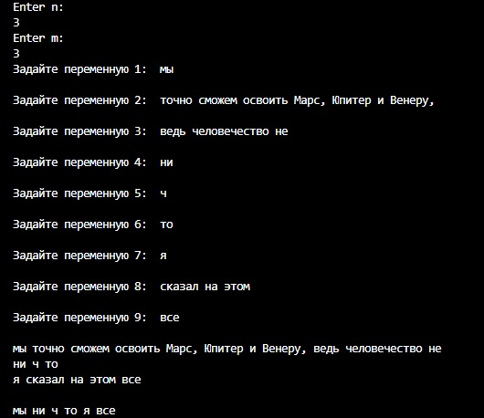

# Описание кода

## Цель написания кода
* При помощи кода пользователь должен иметь возможность самостоятельно задавать размеры двумерного массива.
* Для каждой переменной пользователь должен иметь возможность самостоятельно задавать текстовое значение.
* Далее код должен прописанными функциями "*посмотреть*" какое количество символов содержится в каждой переменной.
* По итогу должен создаться массив, состоящий только из тех переменных, в которых от трех и менее символов, после чего полученный массив должен выводиться на экран.

## Синтаксис кода
* В коде используется четыре функции **void**.
    
    1. Первая функция "*FillArray*" предоставляет пользователю возможность ввести с клавиатуры значение каждой переменной поочередно. Это происходит при помощи перебора всех элементов массива с помощью двух циклов (один вложен в другой) и индексов элементов. В каждый элемент вводится значение командой "_array0[i, j] = Convert.ToString(Console.ReadLine() ?? "0"); ;_", где "**i**" и "**j**" индексы, по которым определяется расположение элемента в двумерном массиве.

    2. Вторая функция "*PrintArray*" тем же способом (два цикла и индексы) выводит массив на экран при помощи функции "_Console.Write($"{array[i, j]} ");_".

    3. Третья функция "*RebuildArray*" при помощи переменной _length_, которая обозначает длину элемента массива, проверяет, подходит ли элемент массива под требование (не больше трех символов в элементе) и, если элемент подходит под требование, записывает его в список объектов типа "**List**".

    Далее в основной части кода список переписывается в новый массив.

    4. После этого четвертая функция кода "*PrintStrings*" по тому же принципу, что и фунция "*PrintArray*", выводит элементы второго массива на экран.

    ## Примечания
    + В коде используется двумерный, а не одномерный, массив в двух целях:
        
        1. Это один из самых простых способов создать текст в несколько строк при помощи массива.
        2. Демонстрация того, что я освоил работу с двумернми массивами и вложенными циклами.

    + Ниже приведен пример данных, которые выводятся в терминале после запуска кода:

        